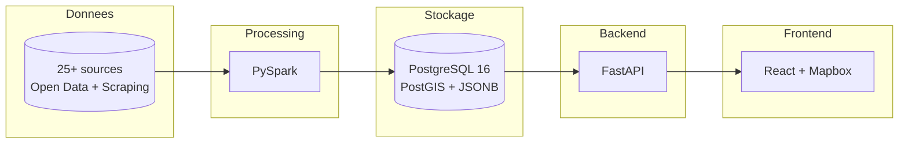
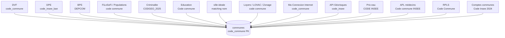
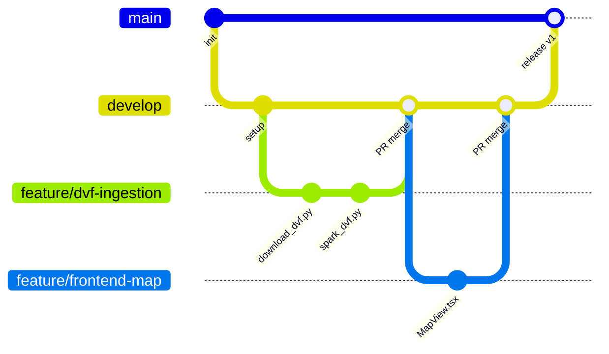
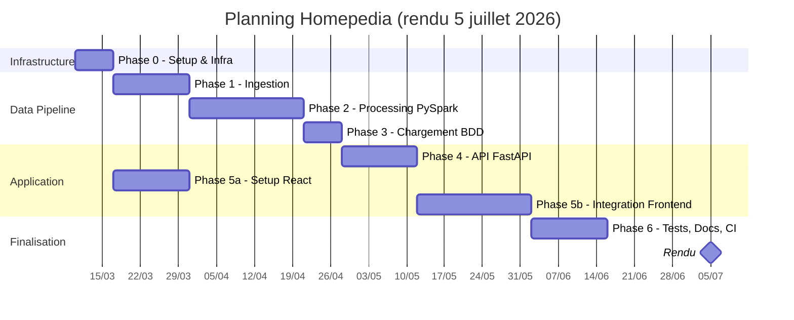

# Homepedia -- Cadrage Projet

> **Module** : T-DAT-902 (Epitech Big Data)
> **Équipe** : 5 personnes
> **Durée** : janvier — juillet 2026 (rendu le 5 juillet 2026)
> **Version** : v2 — Mars 2026

---

## 1. Contexte et objectifs

Homepedia est une plateforme d'analyse du marché immobilier français. Elle permet de collecter, traiter et visualiser des données immobilières et socio-économiques à différentes échelles géographiques : nationale, régionale, départementale et communale.

### Objectifs principaux

- **Agréger** des données publiques multi-sources (transactions, énergie, équipements, revenus, criminalité, avis habitants)
- **Traiter** de gros volumes via un pipeline Big Data (PySpark)
- **Stocker** dans une base unique PostgreSQL + PostGIS + JSONB
- **Exposer** via une API REST (FastAPI)
- **Visualiser** via une interface cartographique interactive (React + Mapbox)

### Vue d'ensemble du stack

---

## 2. Périmètre

### Core (obligatoire)

| Fonctionnalité | Description |
|----------------|-------------|
| Pipeline données | Ingestion, traitement PySpark, chargement PostgreSQL |
| API FastAPI | Endpoints communes, prix, stats, geo, reviews |
| Frontend React | Carte interactive centrée sur une adresse : POI (Mapbox), prix DVF, risques, isochrones, fiche commune |
| Traitement avis | Notes agrégées + word cloud basique (ville-ideale.fr) |
| CI/CD | GitHub Actions (lint + tests backend/frontend) |

### Bonus (si le temps le permet)

| Fonctionnalité | Description |
|----------------|-------------|
| NLP avancé | spaCy, CamemBERT, analyse de sentiment sur les avis |
| Déploiement en ligne | Plateforme à définir (nécessite PostGIS) |
| Scraping pap.fr | Annonces immobilières complémentaires |

---

## 3. Décisions techniques

### Base de données unique : PostgreSQL + PostGIS + JSONB

- **PostGIS** pour le géospatial (contours GeoJSON, index GiST, requêtes bbox)
- **JSONB** pour les données non-tabulaires (avis, annonces, word clouds, index GIN)
- **Pas de MongoDB** : les JOINs cross-domain, l'infra simplifiée et la supériorité de PostGIS sur MongoDB 2dsphere justifient ce choix

### Frontend : React + Vite (pas Next.js)

- **Single-page centrée sur une adresse** : carte plein écran + panneau latéral contextuel, exploration par catégories (POI, prix, risques, isochrones, fiche commune)
- **Pas de React Router** : état (adresse, catégorie, rayon) synchronisé dans l'URL
- **Vite** et non Next.js : pas de SSR nécessaire (dashboard, pas de SEO), Mapbox incompatible SSR, évite un double backend (Node + Python)
- **react-map-gl** (Mapbox GL JS) pour la carte ; données d'adresse via la Base Adresse Nationale, POI / itinéraires / isochrones via les APIs Mapbox

### Big Data : PySpark (unifié)

- **PySpark** pour toutes les sources : DVF (~25-30M lignes), DPE (~9M lignes), BPE, INSEE, criminalité, éducation, etc.
- **Cluster Spark local** via Docker : 1 master + 2 workers (mémoire configurable par machine)
- Pipeline batch (pas temps réel) : exécuté ponctuellement, données ensuite servies depuis PostgreSQL
- **Choix d'un framework unique** : compatibilité garantie sur machines hétérogènes (RAM variable), Spark gère le spill-to-disk si mémoire insuffisante

### Architecture microservices (2 repos)

- **`homepedia-api`** : backend (FastAPI + ingestion + processing + database)
- **`homepedia-front`** : frontend (React + Vite + TypeScript)
- Chaque service est **entièrement dockerisé** (dev + prod)
- Communication via HTTP REST, URL configurable (`VITE_API_URL`)
- Frontend prod : build static Node → Nginx (multi-stage Docker)

### Backend : FastAPI

- Cohérent avec le stack data Python (PySpark, scraping)
- Async natif, Pydantic v2 pour la validation, SQLAlchemy + GeoAlchemy2
- Architecture 3 couches : Router → Service → Repository

### Clé de jointure universelle

**`code_commune` INSEE (5 caractères)** — toutes les sources sont jointes via ce code.

---

## 4. Sources de données

| Source | Volume | Description | Priorité |
|--------|--------|-------------|----------|
| **DVF** (cadastre.data.gouv.fr) | ~25-30M lignes | Transactions immobilières 2014-2025 | P0 |
| **DPE** (data.ademe.fr) | ~9M + ~10.7M | Diagnostics énergie (nouveau + ancien) | P0 |
| **Carte des loyers** (MEF/DHUP) | ~140K lignes | Loyers prédits par commune (×4 fichiers) | P0 |
| **BPE** (INSEE) | ~2M lignes | Équipements (écoles, hôpitaux, gares...) | P0 |
| **FiLoSoFi** (INSEE/DGFiP) | IRIS (XLSX) | Revenus, pauvreté par commune | P0 |
| **Populations** (INSEE) | XLSX (6 MB) | Population historique 1968-2023 | P0 |
| **France Travail** (DARES) | ~2.1M lignes | Demandeurs d'emploi par commune | P0 |
| **COG** (geo.api.gouv.fr) | petit | Référentiel communes/départements/régions | P0 |
| **Contours GeoJSON** (data.gouv.fr) | ~200 MB | Géométries administratives | P0 |
| **ville-ideale.fr** (scraping) | ~91K avis | Notes 8 critères + commentaires | P0 |
| **Criminalité** (SSMSI) | ~4.7M lignes | 15 indicateurs par commune depuis 2016 | P1 |
| **Éducation** (data.gouv.fr) | CSV | DNB + IVAL (résultats scolaires) | P1 |
| **Impôts locaux** — REI (DGFiP) | ~35K × 1101 col | Taxe foncière, base imposable | P1 |
| **LOVAC** (DGFiP) | ~35K lignes | Logements vacants 2020-2025 | P1 |
| **Zonage ABC** (MEF/DHUP) | ~35K lignes | Tension immobilière par commune | P1 |
| **pap.fr** (scraping) | ~5-10K annonces | Annonces immobilières | P1 |
| **Ma Connexion Internet** (ARCEP) | CSV | Éligibilité fibre/THD par commune (34 877 communes, `commune_techno.csv` nécessaire pour fibre/THD) | P1 |
| **API Géorisques** (BRGM) | API REST | Risques naturels/technologiques par commune | P1 |
| **Ensoleillement** (Hello Watt) | CSV (1.4 KB) | Jours ensoleillement par département (92 depts métropole) | P1 |
| **Prix de l'eau** (SISPEA / services.eaufrance.fr) | XLS (~30 MB) | Tarif eau potable/assainissement par commune (~33 600 communes) | P1 |
| **APL** (DREES) | XLSX | Accessibilité médecins généralistes par commune | P1 |
| **RPLS** (SDES) | ~5M lignes | Logements sociaux géolocalisés | P2 |
| **Comptes communes** (OFGL) | ~22.4M lignes | Finances communales 2017-2024 | P2 |
| **Nuance politique** (Datactivist) | CSV (1.4 MB) | Nuance politique du maire par commune | P2 |
| **Déplacements domicile-travail** (INSEE) | ~70 MB / 1.19M lignes | Flux domicile-travail par commune (format long) | P2 |
| **Données climatologiques** (Météo-France) | 626 CSV.gz | Températures, précipitations, vent par station (`INST` absente des fichiers RR-T-Vent) | P2 |

### Notes sur les données

- DVF mis à jour semestriellement (avril/octobre)
- DPE mis à jour en continu (~35K nouvelles entrées/semaine)
- Paris/Lyon/Marseille ont des arrondissements (codes spéciaux)
- Attention aux fusions de communes (codes qui changent) → utiliser COG historique
- leboncoin.fr **exclu** (risque légal)

---

## 5. Contraintes

- **Budget** : 0€ — tout doit être gratuit et open-source
- **Données** : les plus récentes possibles (2014-2025)
- **Scalabilité** : démontrer la capacité à scaler (Airflow/Kafka documentés même si pas implémentés)
- **Infra** : Docker local (microservices), configs prod-ready pour déploiement futur
- **Légalité** : respect strict des CGU pour le scraping, rate-limiting, robots.txt

---

## 6. Stratégie de branches

---

## 7. Planning macro

| Phase | Semaines | Contenu |
|-------|----------|---------|
| Phase 0 | S1 | Setup, infrastructure, Docker, schéma BDD |
| Phase 1 | S2-3 | Ingestion des données (téléchargement + scraping) |
| Phase 2 | S3-5 | Traitement Big Data (PySpark) |
| Phase 3 | S5 | Chargement en base PostgreSQL |
| Phase 4 | S5-6 | API Backend FastAPI |
| Phase 5 | S5-7 | Frontend React (en parallèle dès P5-0) |
| Phase 6 | S7-8 | Tests, documentation, CI/CD, optimisation |

