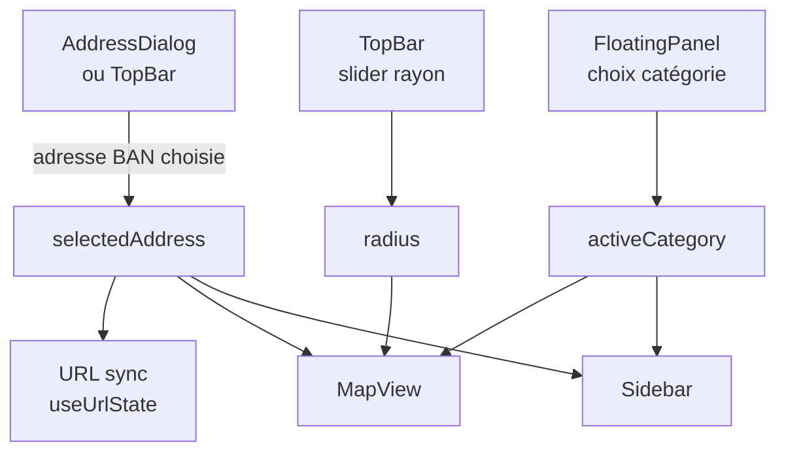

# Frontend React

> **Stack** : React 19 + Vite + TypeScript + react-map-gl (Mapbox GL) +
> @tanstack/react-query + Tailwind CSS + lucide-react
>
> Voir aussi : [api-contrat.md](api-contrat.md) (sources de données consommées)

L'application est une **single-page centrée sur une adresse**. Il n'y a pas de
React Router ni de navigation par niveau géographique : on sélectionne une adresse
puis on explore son voisinage via des **catégories**.

---

## Flux principal



1. **Choix de l'adresse** — `AddressDialog` (au premier chargement si l'URL n'en
   contient pas) ou la barre de recherche du `TopBar`. Les suggestions viennent de
   la Base Adresse Nationale (`useAddressSearch` / `useAddressAutocomplete`).
2. **Choix d'une catégorie** — colonne d'icônes `FloatingPanel`.
3. **Rendu** — `MapView` (plein écran) affiche les données autour de l'adresse dans
   le `radius` courant ; la `Sidebar` détaille la catégorie active.
4. **Partage** — `useUrlState` (`getInitialStateFromUrl` / `useUrlSync`) garde
   l'adresse, la catégorie et le rayon dans l'URL.

---

## Catégories

Définies dans [`src/components/categories.tsx`](../src/components/categories.tsx)
(`type CategoryId`).

| Catégorie | `CategoryId` | Contenu | Données |
| --- | --- | --- | --- |
| Écoles | `schools` | POI + itinéraire à pied | Mapbox Search Box |
| Commerces | `shops` | POI + itinéraire à pied | Mapbox Search Box |
| Transports | `transport` | POI + itinéraire à pied | Mapbox Search Box |
| Santé | `health` | POI + itinéraire à pied | Mapbox Search Box |
| Espaces verts | `parks` | POI + itinéraire à pied | Mapbox Search Box |
| Risques & Air | `risks` | risques recensés + qualité de l'air + points de risque sur la carte | API `risques`, `qualite-air` |
| Accessibilité | `isochrone` | zones accessibles à pied (5 / 10 / 15 min) | Mapbox Isochrone |
| Ville | `city` | fiche commune : population, note, équipements, sécurité, éducation, word cloud | API `communes`, `reviews`, `equipements`, `securite`, `education` |
| Prix | `prix` | transactions DVF à proximité (colonnes 3D ou dégradé), prix/m² | API `prix/points` |

Pour les catégories POI, un clic sur un élément de la `Sidebar` trace l'itinéraire
à pied depuis l'adresse (`useRouteQuery`) et les durées de trajet sont pré-calculées
(`useRouteDurationsQuery`).

---

## Composants

| Composant | Rôle |
| --- | --- |
| `App` | Composition : état (adresse, catégorie, rayon, POI sélectionné, mode prix) et branchement des hooks |
| `AddressDialog` | Sélection de l'adresse au premier chargement |
| `TopBar` | Recherche d'adresse, slider de rayon, recentrage carte |
| `FloatingPanel` | Colonne d'icônes de catégories |
| `map/MapView` | Carte Mapbox plein écran (POI, points de risque, colonnes/dégradé de prix, isochrones, itinéraire). Expose `recenter()` via `MapViewHandle` |
| `sidebar/Sidebar` | Panneau latéral contextuel selon la catégorie active |
| `categories.tsx` | Déclaration des catégories + panneaux de rendu (`renderPanel` / `renderCustomPanel`) |

---

## Hooks (react-query)

| Hook | Source | Rôle |
| --- | --- | --- |
| `useAddressSearch` / `useAddressAutocomplete` | BAN | recherche d'adresse (debounce 300 ms) |
| `usePoisQuery` | Mapbox Search Box | POI par catégorie autour de l'adresse |
| `useRouteDurationsQuery` | Mapbox Directions Matrix | durées de trajet adresse → POI |
| `useRouteQuery` | Mapbox Directions (walking) | itinéraire vers le POI sélectionné |
| `useIsochroneQuery` | Mapbox Isochrone | zones 5 / 10 / 15 min à pied |
| `usePrixPointsQuery` | API `prix/points` | transactions DVF dans le rayon |
| `useRiskPointsQuery` | API `risques/geopoints` | points de risque sur la carte |
| `useGeorisquesQuery` | API `risques` + `qualite-air` | risques recensés + qualité de l'air de la commune |
| `useCityQuery` | API `communes` + `reviews` + `equipements` + `securite` + `education` | agrégat de la fiche « Ville » |
| `useDebouncedValue` | — | debounce générique |
| `useUrlState` | — | (dé)sérialisation de l'état dans l'URL |

---

## Accès aux données

Client HTTP générique : [`src/api/httpClient.ts`](../src/api/httpClient.ts)
(`FetchHttpClient.getJson<T>`, gère la query string et l'`AbortSignal`).

Les **repositories** ([`src/repositories/`](../src/repositories/)) encapsulent les
endpoints backend. La plupart suivent le même patron
`/api/v1/<domaine>/{codeCommune}` et sont créés par
`createCommuneRepository(path)` :

```typescript
// src/repositories/equipementRepository.ts
export const equipementRepository =
  createCommuneRepository<CommuneEquipements>("equipements");
```

Deux repositories ont des endpoints spécifiques :
`prixRepository.getPoints(bbox, { limit })` → `/api/v1/prix/points` et
`risqueRepository.getGeopoints(bbox)` → `/api/v1/risques/geopoints`.

La base URL vient de `import.meta.env.VITE_API_URL`. Si la variable est absente,
`FetchHttpClient` utilise `window.location.origin` et les appels partent en relatif
(`/api/...`) — pris en charge par le proxy Vite en dev, par Nginx en prod.

---

## Config Vite

```typescript
// vite.config.ts
export default defineConfig({
  plugins: [react(), tailwindcss()],
  server: {
    proxy: {
      "/api": { target: "http://localhost:8000", changeOrigin: true },
    },
  },
});
```

Le serveur de dev écoute sur le **port 3000** (`npm run dev` → `vite --port 3000`).
En production, Nginx ([nginx.conf](../nginx.conf)) sert le build statique et proxifie
`/api/` vers le service `api`.
