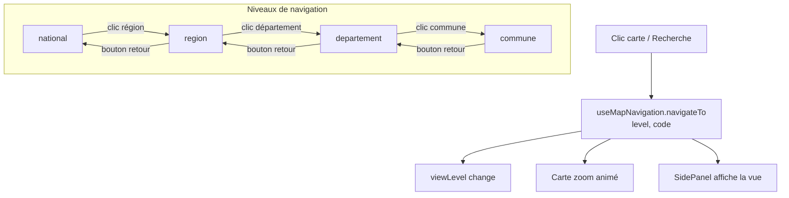

# Frontend React

> **Stack** : React + Vite + TypeScript + react-map-gl + Recharts + Tailwind
>
> Voir aussi : [architecture.md](architecture.md) (vue d'ensemble) · [api-contrat.md](api-contrat.md) (endpoints détaillés)

---

## Navigation par viewLevel (single-page)

L'application est une **single-page** sans React Router. La navigation se fait par changement de `viewLevel` via le hook `useMapNavigation`.



```typescript
type ViewLevel = "national" | "region" | "departement" | "commune";
type ViewMode = "explore" | "tendances" | "comparaison" | "energie" | "avis";

interface MapNavigationState {
  viewLevel: ViewLevel;
  viewMode: ViewMode;
  codeRegion: string | null;
  codeDepartement: string | null;
  codeCommune: string | null;
  navigateTo: (level: ViewLevel, code?: string) => void;
  setViewMode: (mode: ViewMode) => void;
  goBack: () => void;
}
```

**Flux** :
1. **Clic carte** : national → clic région → `region` → clic dept → `departement` → clic commune → `commune`
2. **Recherche** : saut direct à n'importe quel niveau
3. **Bouton retour** : remonte d'un niveau
4. **Navbar** : accès aux modes spéciaux (tendances, comparaison, énergie, avis)

---

## Détail CommuneView (onglets)

```
SidePanel :
├─ KpiCards → résumé (prix, population, DPE, note, zone ABC, loyer, vacance)
├─ Tab "Prix"         → LineChart historique + BoxPlot distribution
├─ Tab "Loyers"       → KpiCards (loyer/m² app, maison) + comparaison achat vs loyer
├─ Tab "DPE"          → BarChart classes A-G
├─ Tab "Équipements"  → BarChart par catégorie
├─ Tab "Revenus"      → KpiCards (revenu, pauvreté, chômage)
├─ Tab "Logement"     → BarChart vacance + KpiCards (logements sociaux, zone ABC)
├─ Tab "Criminalité"  → BarChart par type
└─ Tab "Avis"         → RadarChart 8 critères + WordCloud
```

---

## Correspondance vues ↔ endpoints

Le tableau détaillé des correspondances entre vues, endpoints API et comportement carte se trouve dans **[api-contrat.md](api-contrat.md)**.

---

## Client API centralisé

```typescript
// src/api/client.ts (repo homepedia-front)
const API_BASE = import.meta.env.VITE_API_URL || "/api/v1";

export async function fetchApi<T>(
  endpoint: string,
  params?: Record<string, string>,
): Promise<T> {
  const url = new URL(`${API_BASE}${endpoint}`, window.location.origin);
  if (params) {
    Object.entries(params).forEach(([k, v]) => url.searchParams.set(k, v));
  }
  const res = await fetch(url.toString());
  if (!res.ok) {
    const error = await res.json();
    throw new Error(error.message || `API error ${res.status}`);
  }
  return res.json();
}
```

---

## Custom hooks (TanStack Query)

```typescript
// src/hooks/useCommune.ts (repo homepedia-front)
export function useCommune(code: string | null) {
  return useQuery({
    queryKey: ["commune", code],
    queryFn: () => fetchCommune(code!),
    enabled: !!code,
    staleTime: 1000 * 60 * 60, // 1h
  });
}
```

---

## Filtres globaux

```typescript
interface FilterState {
  dateRange: [number, number]; // [2014, 2025]
  typeLocal: string[];         // ["Maison", "Appartement"]
}
```

---

## Composants réutilisables

| Composant | Props principales | Vues |
|-----------|-------------------|------|
| **Layout** | `children` | Wrape App.tsx |
| **MapView** | `geojson`, `indicator`, `level`, `palette`, `bbox`, `onFeatureClick` | Toujours visible |
| **SidePanel** | `viewLevel`, `viewMode`, `children` | Toujours visible |
| **Charts.LineChart** | `data`, `xKey`, `yKey`, `series[]`, `title` | National, Region, Dept, Commune, Tendances |
| **Charts.BarChart** | `data`, `categoryKey`, `valueKey`, `colors` | Commune (DPE, Équipements, Crime) |
| **Charts.RadarChart** | `data`, `categories[]`, `series[]` | Commune (Avis), Comparaison |
| **Charts.BoxPlot** | `data`, `quartiles`, `outliers` | Commune (Prix) |
| **Filters** | `dateRange`, `typeLocal`, `communes`, `onChange` | Dept, Tendances, Comparaison |
| **KpiCards** | `items: {label, value, trend?, icon?}[]` | National, Commune |
| **WordCloud** | `words: {mot, fréquence}[]`, `maxWords` | Commune, Avis |

---

## Config Vite

```typescript
// vite.config.ts (repo homepedia-front)
export default defineConfig({
  plugins: [react()],
  server: {
    port: 5173,
    host: true, // Accessible depuis Docker
  },
});
```

> **Note** : en architecture microservices, le frontend utilise `VITE_API_URL` (variable d'env) pour appeler l'API, pas de proxy Vite. En production, le reverse proxy Nginx gère le routage `/api/` vers le backend.
